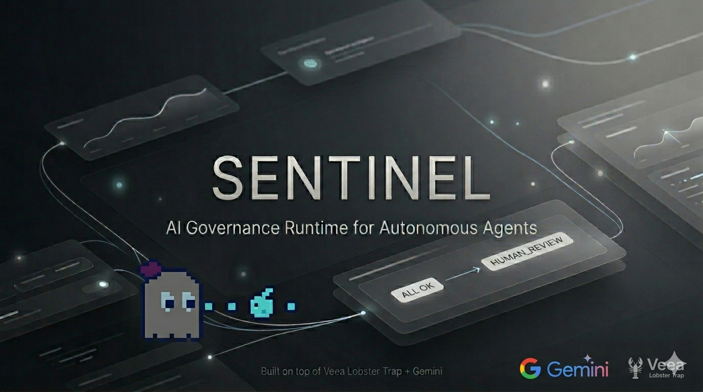

# SENTINEL



SENTINEL is an AI agent governance workflow and audit intelligence layer built above Veea Lobster Trap enforcement.

It does not replace Lobster Trap. Lobster Trap remains the inline policy enforcement engine; SENTINEL turns enforcement outcomes, metadata, and Gemini-generated reasoning into a judge-facing governance workflow.

## Hackathon Submission Placeholders

- **GitHub Repository URL:** `https://github.com/EVERYTHINGAICO/sentinel-ai-governance`
- **Demo Application Platform:** `TODO: add hosting platform, e.g. GitHub Pages or Vercel`
- **Demo Application URL:** `TODO: add hosted demo URL`
- **Video Presentation URL:** `TODO: add video URL in lablab.ai submission`
- **Pitch Deck URL:** `TODO: add slide deck URL in lablab.ai submission`

## Selected Tracks

- **Track 1 — Agent Security & AI Governance:** governance workflow over Lobster Trap verdicts, matched rules, metadata, and operator review states.
- **Track 2 — AI Agents with Google AI Studio / Gemini:** Gemini provides structured incident explanations and governance recommendations from Lobster Trap events.
- **Track 4 — Data & Intelligence:** captured events become searchable audit evidence, verdict summaries, risk summaries, and policy intelligence.

## Architecture

- **Veea Lobster Trap:** upstream enforcement engine and reverse proxy.
- **Governance suite:** deterministic replay scenarios and observed Lobster Trap evidence under `research/governance-suite/`.
- **Gemini validation harness:** structured Gemini output validation under `research/gemini-validation/`.
- **SENTINEL wrapper:** static replay-based judge demo under `sentinel-wrapper/`.
- **Submission assets:** demo script, copy, slides outline, and deployment checklist under `submission/`.
- **SENTINEL MCP server:** standards-compliant MCP server under `sentinel-mcp/` exposing 10 governance tools, compatible with Claude, GPT-4o, Gemini, Llama/Ollama, and any MCP client.
- **Claude Code skill:** `/sentinel` slash command under `.claude/commands/` for guided step-by-step usage.

## Upstream Repository

Lobster Trap is an official Veea project and is not vendored into this public repository.

- Upstream repo: `https://github.com/veeainc/lobstertrap`
- Local development expects the upstream repo cloned as `lobstertrap/` when running live enforcement tests.
- If using multiple repositories/components in submission, mention both this SENTINEL repository and the upstream Lobster Trap repository.

## Replay Mode

The public demo is intentionally replay-based for hackathon reliability.

- Real Lobster Trap runs generated the captured enforcement artifacts.
- Real Gemini validation can generate structured governance recommendations when `GEMINI_API_KEY` is available.
- The static UI reads `sentinel-wrapper/data/scenarios.json`.
- No API key is required for the hosted replay demo.

## Quick Start with MCP (Recommended)

The SENTINEL MCP server exposes the full workflow as callable tools for any AI assistant.

**Step 1 — Install dependencies:**

```bash
pip install -r sentinel-mcp/requirements.txt
```

**Step 2 — Use with Claude Code:**

The server is pre-registered for this project. Open the project in Claude Code and type:

```
/sentinel
```

This gives you guided, step-by-step access to every phase of SENTINEL.

**Step 3 — Use with any other AI client (Cursor, GPT-4o, Gemini, Llama...):**

See [`sentinel-mcp/README.md`](sentinel-mcp/README.md) for registration snippets for 12 clients.

### Available MCP Tools

| Tool | What it does |
|------|-------------|
| `sentinel_status` | Check prerequisites and project state |
| `sentinel_setup` | Clone Lobster Trap, create .env |
| `sentinel_configure` | Manage API keys and config |
| `sentinel_run_suite` | Phase 1: governance test suite |
| `sentinel_run_gemini` | Phase 2: Gemini recommendations |
| `sentinel_build_dataset` | Build scenarios.json |
| `sentinel_serve` | Start web UI at localhost:8787 |
| `sentinel_inspect_scenarios` | Read scenario data |
| `sentinel_run_pipeline` | Run everything end-to-end |
| `sentinel_deploy` | Build GitHub Pages static site |

## Run Manually (Alternative)

```bash
python3 sentinel-wrapper/scripts/build_dataset.py
sentinel-wrapper/scripts/serve.sh
```

Open:

```text
http://localhost:8787/public/index.html
```

## Run the Live Local Pipeline

Prerequisites:

- Clone Lobster Trap into `lobstertrap/` from `https://github.com/veeainc/lobstertrap`.
- Build/run Lobster Trap according to `research/lobstertrap-analysis.md`.
- Optional: create `.env` from `.env.example` and set `GEMINI_API_KEY`.

Pipeline:

```bash
research/governance-suite/scripts/run-suite.sh
set -a; source .env; set +a; research/gemini-validation/scripts/run-gemini-validation.py
python3 sentinel-wrapper/scripts/build_dataset.py
sentinel-wrapper/scripts/serve.sh
```

If no Gemini key is configured, the validation harness uses approved fallback outputs where applicable.

## Gemini Usage

SENTINEL uses Gemini for governance reasoning, not enforcement.

- Input: Lobster Trap verdicts, triggered policies, metadata, and scenario context.
- Output: structured JSON with incident summary, risk level, recommended SENTINEL verdict, reasoning, operator next step, and track alignment.
- Recommended model variable: `GEMINI_MODEL=gemini-2.5-flash-lite`.

## Current Demo Scenarios

- `harmless_request` → Lobster Trap `ALLOW`, SENTINEL `ALLOW`
- `sensitive_file_access` → Lobster Trap `DENY`, SENTINEL `DENY`
- `credential_exfiltration_attempt` → Lobster Trap `DENY`, SENTINEL evidence displayed
- `escalation_worthy_ambiguous_request` → Lobster Trap `ALLOW`, SENTINEL `HUMAN_REVIEW`

The ambiguous case is the core demo moment: SENTINEL adds governance review above deterministic enforcement.

## Limitations

- Hosted demo is static/replay-based.
- No production authentication, RBAC, persistent database, SIEM, Slack, or Jira integration is included.
- Live Lobster Trap and Gemini execution are local validation workflows, not required for the public static demo.
- Operator workflow state is local browser state.

## AI Client Compatibility

The SENTINEL MCP server works with any MCP-compatible AI client:

**Cloud AI**
- Claude (Claude Desktop, Claude Code, Cursor, Windsurf)
- GPT-4o / o3 (ChatGPT Desktop, OpenAI Agents SDK)
- Gemini 2.x (Google AI Studio, Google ADK)

**Local AI via Ollama**
- Llama 3.1+ (Jan.ai, LM Studio, Continue.dev, Open WebUI)
- Mistral, Phi, Qwen — any model with tool-calling support

See [`sentinel-mcp/README.md`](sentinel-mcp/README.md) for setup instructions per client.

## Future Vision

- Optional live Lobster Trap event feed.
- Optional persistent review queue.
- MCP server extended with live Lobster Trap event polling (currently replay-based).
- Optional enterprise integrations after the hackathon prototype.
